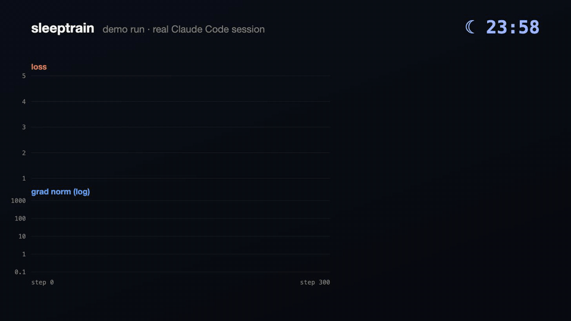
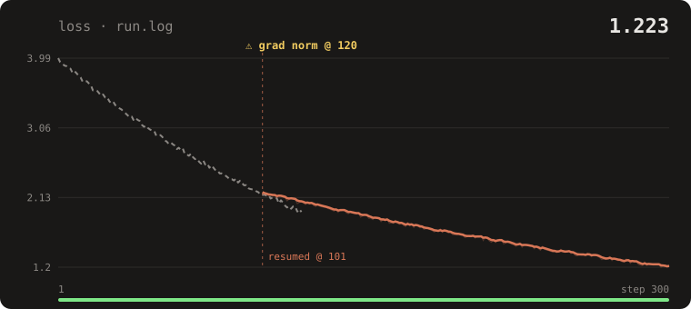
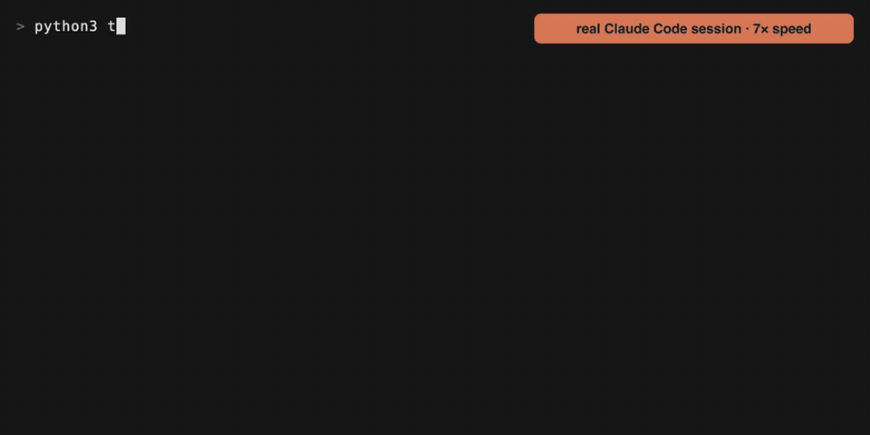
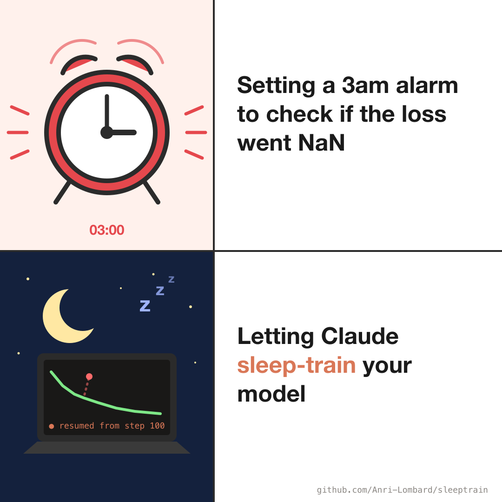

# sleeptrain

**Claude watches your training runs so you can sleep. One run, or a whole SLURM sweep.**

You start a 10-hour run (or 15 of them on the cluster) at midnight. At 02:13 one goes NaN, and you
find out at 08:00. sleeptrain is a Claude Code plugin that sits on your runs overnight. When one
breaks, Claude reads the log, works out what happened, resumes from the last good checkpoint with a
safer setting (if you allowed it), and leaves you a report for the morning.

<p align="center"></p>

In the morning you get a report with a loss chart that marks where the run broke and where Claude
picked it up:

<p align="center"></p>

```
## sleeptrain: run.log, 23:10 -> 06:42
Status:    finished, step 20000/20000, final loss 2.31
Overnight: NaN at step 8,410 (LR 3e-4, fp16). Resumed from step 8,000 at LR 1.5e-4 -> stable.
Changed:   lr 3e-4 -> 1.5e-4 (run.r1.log). Nothing else.
Look at:   loss spike at step 14,200 recovered on its own, probably a data shard switch.
```

<details>
<summary>The unedited Claude Code session behind that animation (7× speed)</summary>
<p align="center"></p>
</details>

## Why not just ask Claude to watch the log?

For one local run, Claude Code can tail a log on its own and often does fine. sleeptrain is for the
night shift on real training jobs:

- **Whole sweeps on a cluster.** One stdlib watcher on the login node (over ssh, nothing to install)
  follows every SLURM job you own, picks up new jobs as they start, and wakes Claude when one fails,
  times out, runs out of memory or gets preempted. Not for jobs that finish or that you cancel.
- **Earlier warning.** It watches the grad norm, which usually explodes a few steps before the loss does.
- **Never resumes from a broken checkpoint.** A checkpoint saved after things started going wrong
  is skipped, not restored.
- **Guardrails.** Report-only unless you allow fixes; then only LR, warmup, micro-batch (with matching
  grad accumulation) or precision, at most 3 resumes a night, and never your data, model size or eval.
- **Built to last the night.** A 20-minute heartbeat so agent time limits never kill the watch, no
  orphaned processes on shared login nodes, and near-zero tokens while runs are healthy.
- **A morning report** with a progress bar, loss sparkline and a chart of where it broke and resumed.

## Install

```
/plugin marketplace add Anri-Lombard/sleeptrain
/plugin install sleeptrain@sleeptrain
```

## Use

Tell Claude what to watch:

> babysit my run: logs in runs/run.log, slurm job 123456. You can resume from checkpoint if it breaks.

or just `/sleeptrain:babysit`. Claude asks for anything it can't work out, starts the watcher and
goes quiet until something happens.

Running a sweep? One watcher covers every SLURM job you own, including jobs that start later:

> babysit all my jobs on hpc tonight, the metrics are in runs/*/train_log.jsonl

Try it in a few minutes with the demo run, which goes unstable partway through (the script doesn't say
when or why, so Claude has to work it out from the log):

```bash
python3 examples/flaky_train.py --delay 0.4 > run.log 2>&1 &
```

> babysit run.log, you may fix and resume

## What it catches

| Event | Detected from |
|---|---|
| NaN / inf loss | the train loss in your log: `loss 2.31`, `loss=nan`, `{'loss': 2.31}`, `train/loss: ...` |
| Loss spike | loss above 3x the median of the last 50 steps |
| Exploding gradients | grad norm NaN or 10x its recent median, usually a few steps *before* the loss blows up |
| CUDA OOM | `out of memory`, `OutOfMemoryError`, `oom-kill`, `Killed` |
| Crash | Python tracebacks, CUDA / NCCL errors, segfaults |
| Hang | no log output for 30 minutes while the job is running |
| Full disk | under 2 GB free where the run writes (checkpoints pile up) |
| Dead job | local PID gone, or SLURM state `TIMEOUT`, `FAILED`, `OUT_OF_MEMORY`, `NODE_FAIL`, `PREEMPTED`; in sweep mode, for every job you own |

Works with anything that prints a loss: PyTorch, HF Trainer, Lightning, nanoGPT, torchtune, JAX.

## Ask how it's going

> how's my run?

```
run.r1.log  [████████████████░░░░░░░░]   66%  step 198/300  · ~1h 04m left
loss 1.707  ████▇▆▆▅▅▄▄▃▄▄▃▃▂▂▂▂▁▁▁▁▂▂▂▂▂  min 1.585 · 1 resume
```

Add "check in every hour" and Claude sends you that every hour too (as a push notification if
you have them set up).

## How it works

`skills/babysit/watch.py` is a ~260-line, stdlib-only Python script that follows the log and
blocks until something needs attention, then prints one JSON event and exits. Claude runs it
in the background, so it costs **almost no tokens while the run is healthy**: a quiet check-in
every 20 minutes (agent background tasks get killed if they run longer) and a real wake-up only
when something breaks. Since it's stdlib only, it also runs on a cluster login node over ssh with nothing
installed:

```bash
ssh hpc 'python3 - --log runs/123456.out --slurm 123456' < watch.py
```

`skills/babysit/chart.py` draws the progress bar, sparkline and SVG chart, also stdlib only.

The skill (`skills/babysit/SKILL.md`) is the playbook: what to check for each event, which fixes
are allowed (LR, warmup, micro-batch with matching grad accumulation, precision, resubmitting),
and the guardrails.

## Guardrails

- **Report-only by default.** Claude only resumes runs if you said it could.
- Never deletes or overwrites checkpoints or logs. Resumed runs write to `run.r1.log`, `run.r2.log`, ...
- Never touches your data, model size, eval or token budget.
- At most 3 automatic resumes per night, and it stops if the same fix fails twice.

## Things to know

- Claude Code has to stay running overnight. Keep the laptop awake (`caffeinate -i` on macOS)
  or run Claude on a machine that doesn't sleep.
- Use an interactive session. Headless `claude -p` exits when Claude ends its turn, so nothing is
  left to wake when the watcher fires.
- On clusters with 2FA, open an ssh ControlMaster connection before bed so the watcher can
  reconnect without a prompt.
- The loss regex covers common log formats. If yours differs, pass `--loss-regex`.

<p align="center"></p>

## License

MIT
